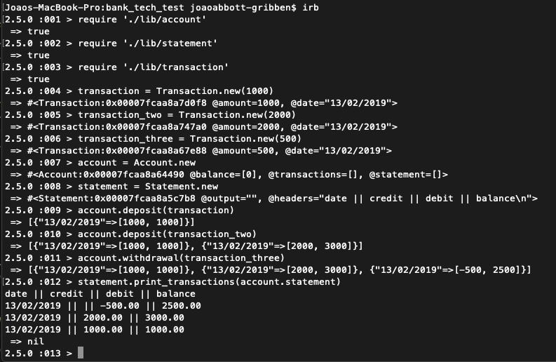

Tech Week Challenge: Bankify
=================

As part of week 10 at Makers I'll be making a very simple command line interface banking app in Ruby

Features from the Makers Brief:
-------

```
  
User stories 

As a customer
So that I don't have to carry around cash
I want a bank account

As a customer
So that I can increase my balance
I want to deposit money in my account

As a customer
So that I can pay for things
I want to make withdrawals from my account

As a customer
So that I can review my finances
I want to know when I made deposits and withdrawals

```


Features spec:
------

### Requirements

* You should be able to interact with your code via a REPL like IRB or the JavaScript console.  (You don't need to implement a command line interface that takes input from STDIN.)
* Deposits, withdrawal.
* Account statement (date, amount, balance) printing.
* Data can be kept in memory (it doesn't need to be stored to a database or anything).

### Acceptance criteria

**Given** a client makes a deposit of 1000 on 10-01-2012  
**And** a deposit of 2000 on 13-01-2012  
**And** a withdrawal of 500 on 14-01-2012  
**When** she prints her bank statement  
**Then** she would see

```
date || credit || debit || balance
14/01/2012 || || 500.00 || 2500.00
13/01/2012 || 2000.00 || || 3000.00
10/01/2012 || 1000.00 || || 1000.00
```


Minimum Viable Product (MVP):
-----
I've decided my MVP will be the back end functionality of the balance, credit and debit behaviour.

After finishing this I will implement the display requirements.


Approach:
-----

* Create UML sequence and diagrams based on the user stories

* Decide on order user stories will be met

* Create branch for new feature, checkout to that branch

* Write a feature test, watch it fail

* Write the code to make it pass

* Refactor

* Make pull request to merge with master branch

* Review changes

* Accept / make change requests

* Merge branch with master

* Repeat this until the MVP is met


Program Structure:
-----

The Account class is responsible for monitoring the account history. It has methods for making withdrawals and deposits and keeping track of the dates on which they were made and the balance that resulted from these transactions.

The Statement class is responsible for outputting this information into the format described in the 'Acceptance Criteria' section above.

There are no dependencies between the classes.


Planned Outcome:
-----

* Everything created using strict TDD (all tests passing, 100% test coverage)

* Practised Git workflow, working on specific branches for each feature before merging back into master (committing with each significant piece of work finished) 

* First four user stories met


Improvements:
-----


Technologies used
-------

* RSpec
* Ruby
* Rubocop
* Travis CI


## How to use bank_tech_test ##

System requirements
-------

* Ruby 2.5.0
* Mac OS X
* Chrome browser


### Set up ###

1. clone the repo<br/>
Under the repo name click *clone or download*<br/>
Click on *use HTTPs*, copy the clone URL of the repo<br/>
In the terminal go on the working directory where you want to clone the project<br/>
Use the `git clone` command and paste the clone URL then press enter :

```shell
$ git clone 
```

2. On your local machine go inside of the *bank_tech_test* directory :

```shell
$ cd bank_tech_test
```
3. To install all the *gems* contained in the *Gemfile*, install and run *Bundle* :
Install :

```shell
$ install bundle
```
Run:

```shell
$ bundle
```
4. You can see the different directories, with the `ls` command.


```

### Run the tests ###

1. Check that the codes are passing the test. From the root *bank_tech_test* directory, run the *spec*.<br/>
You can check all the files in one go:

```shell
$ cd bank_tech_test
$ rspec
```
To check only one file at a time :

```shell
$ cd bank_tech_test
$ rspec spec/file_name_spec.rb
```

2. Check that the code respects the quality of the *Rubocop* guideline, by running `rubocop` from the *bank_tech_test* directory :

```shell
$ cd bank_tech_test
$ rubocop
```

## Run the app ##

1. On the command line, from the root directory *bank_tech_test*, use the `irb` command :

```shell
$ cd bank_tech_test
$ irb
```
2. Follow the steps below to create an account, a statement, withdraw and deposit amounts and output the result of these to the console.




## Authors ##

@joaoag (João Abbott-Gribben)
